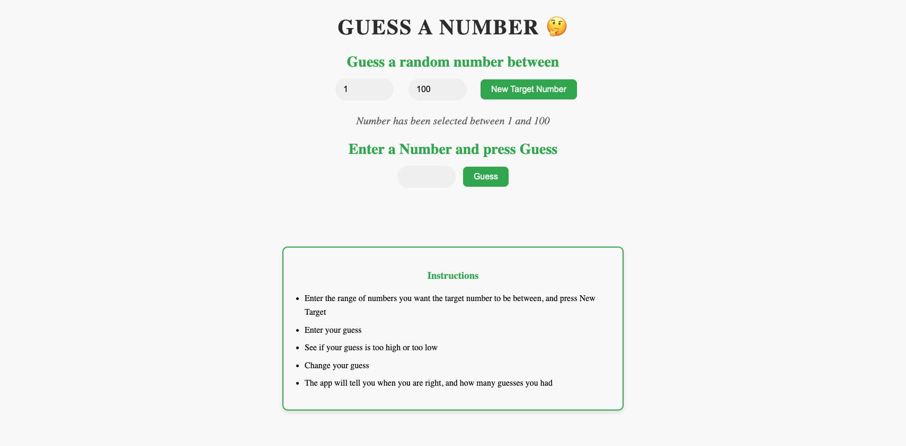

# 🎯 Number Guessing Game

A simple and interactive number guessing game built with HTML, CSS, and JavaScript.  
Users enter a range (min & max), the app randomly generates a number, and the player guesses until they find the correct one with helpful hints.

## 🚀 Features

- Set custom minimum and maximum number range.
- Get real-time hints (Higher / Lower).
- Tracks number of attempts.
- Reset option to start a new game.
- Clean and responsive UI.

## 🔗 Live Demo

Play the game here: [Live Demo](https://neel1209.github.io/web-dev-practice/Number-Guessing-Game/)

## 📸 Screenshot



## 🛠️ Tech Stack

- HTML – structure of the game
- CSS – styling and layout
- JavaScript (Vanilla) – game logic & interactivity

## ⚙️ How to Run

1. Clone this repository:

   ```bash
   git clone https://github.com/neel1209/web-dev-practice/Number-Guessing-Game.git
   ```

2. Open the project folder.  
3. Open `index.html` in your browser.

## 📖 How to Play

1. Enter the minimum and maximum number range.  
2. The system generates a random number.  
3. Guess the number and get hints:  
   - 🔼 “Try Higher” → Your guess is too low.  
   - 🔽 “Try Lower” → Your guess is too high.  
   - ✅ Correct → You win! 🎉  

## ✨ Future Improvements

- Add difficulty levels (easy/medium/hard).
- Show attempt history.
- Add sound effects & animations.

## 🤝 Contributing

Pull requests are welcome! If you’d like to add features or fix bugs, feel free to fork the repo and submit a PR.

## 📜 License

This project is licensed under the MIT License.