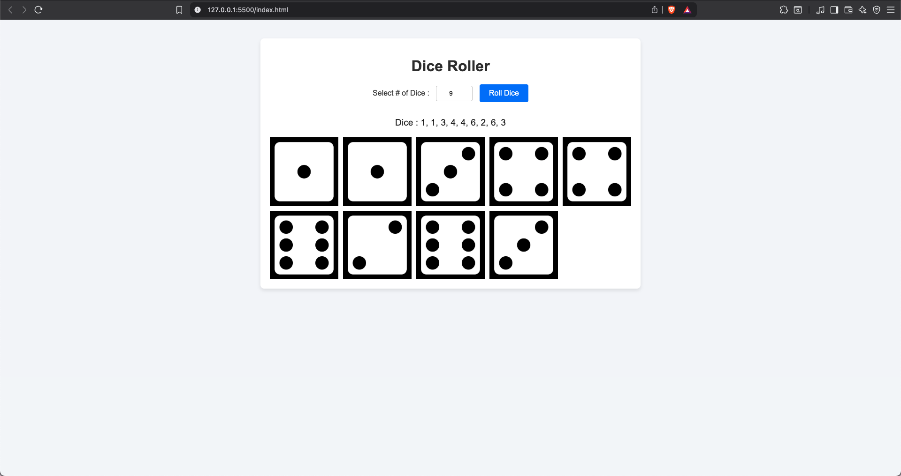

# 🎲 Dice Roller

A simple **Dice Roller web app** built with **HTML, CSS, and JavaScript**.  
Users can select the number of dice to roll, and the app will display both the rolled values and the dice images.

---

## 🚀 Features
- Roll any number of dice (user-defined).
- Displays both numeric results and dice images.
- Responsive layout with a clean UI.
- Random values generated on each roll.

---

## 🌍 Live Demo
Try it out here 👉 [Dice Roller - Live Demo](https://neel1209.github.io/web-dev-practice/dice-roller/)  

---

## 📂 Project Structure
```
.
├── index.html       # Main HTML file
├── style.css        # Styling (CSS)
├── index.js         # JavaScript logic
├── assets/          # Dice images and favicon
```

---

## ⚡ How to Use
1. Clone this repository:
   ```bash
   git clone https://github.com/neel1209/web-dev-practice/dice-roller.git

2.	Open the folder:
    cd dice-roller

3.	Run the project by opening index.html in your browser.

---

## 🛠️ Technologies Used
- **HTML5**
- **CSS3**
- **JavaScript (Vanilla JS)**

---

## 📸 Screenshot
 

---

## 🤝 Contributing
Pull requests are welcome. For major changes, please open an issue first to discuss what you would like to change.

---

## 📜 License
This project is licensed under the MIT License.

---

Made with ❤️ by Neelkumar Patel